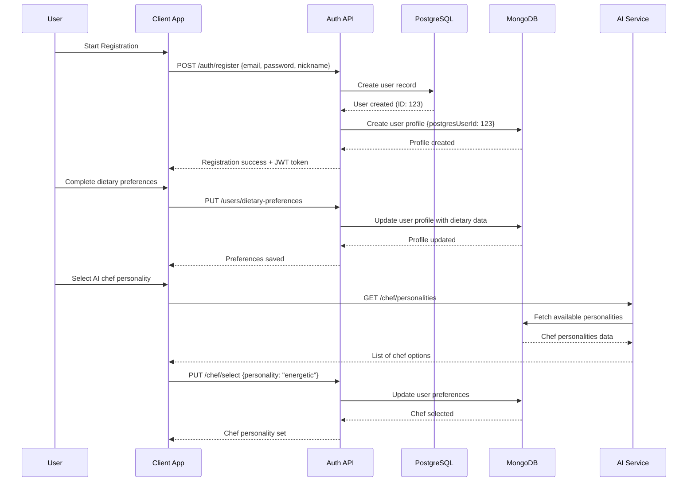
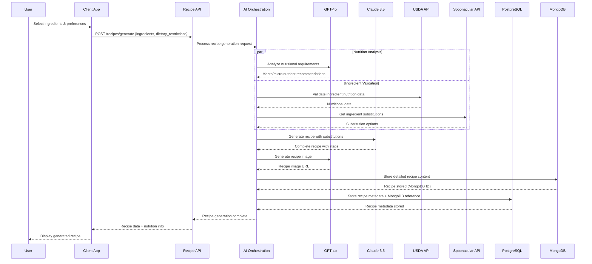
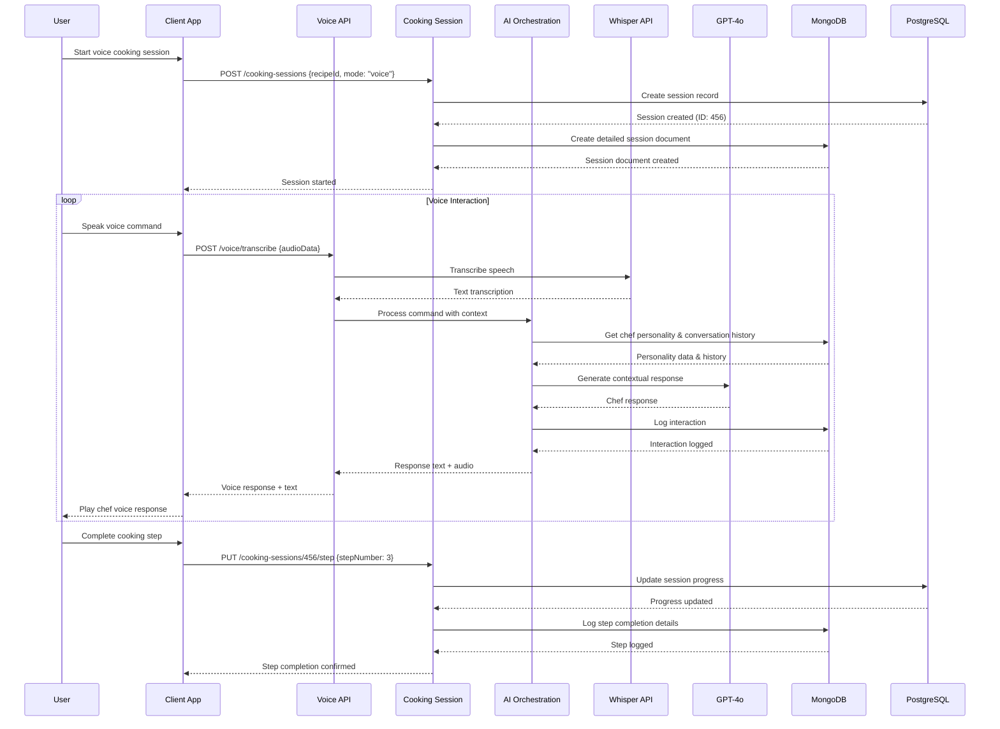
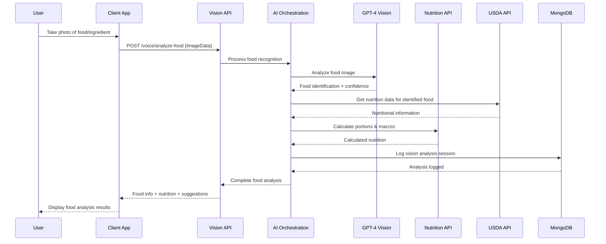
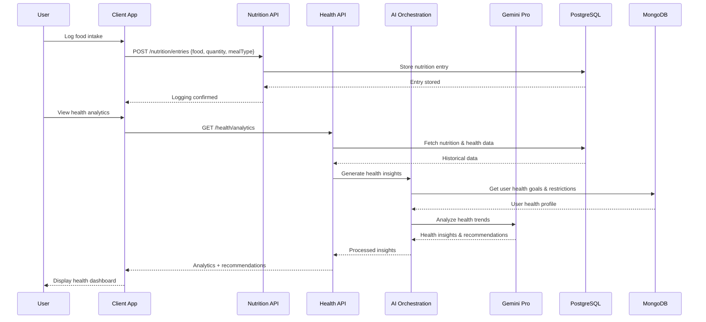
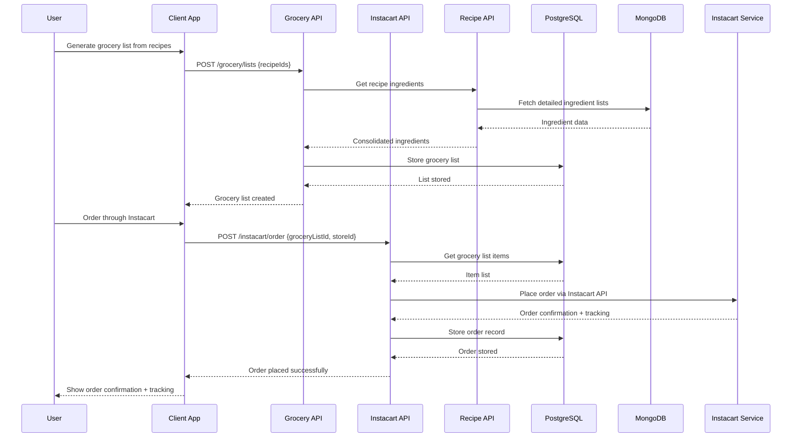
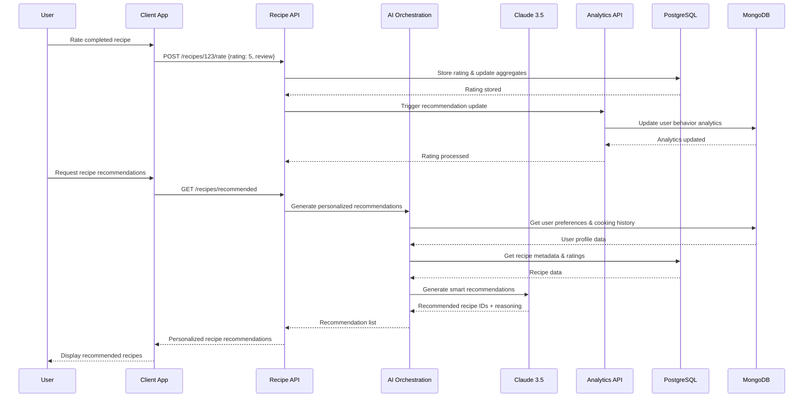
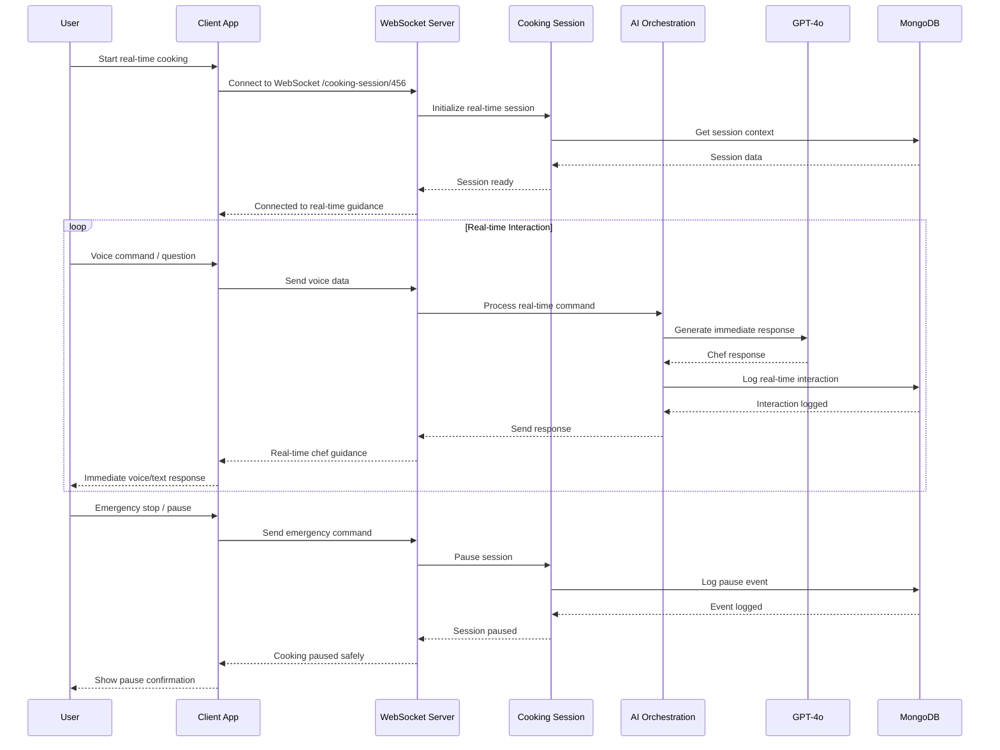

# NutraGenie Sequence Diagrams

## 1. User Registration & Onboarding Flow

## 2. AI Recipe Generation Flow

## 3. Voice Cooking Assistant Flow

## 4. Food Vision Analysis Flow

## 5. Nutrition Tracking & Health Analytics Flow

## 6. Grocery Shopping & Instacart Integration Flow

## 7. Recipe Rating & Recommendation Engine Flow

## 8. Real-time Cooking Guidance Flow

## Key Flow Characteristics

### Performance Optimizations:
- **Parallel API calls** where possible (nutrition analysis + recipe generation)
- **WebSocket connections** for real-time features
- **Caching strategies** for frequently accessed data
- **Database optimization** with proper indexing

### Error Handling:
- **Graceful degradation** when AI services are unavailable
- **Retry mechanisms** for external API failures
- **Fallback responses** for voice cooking assistance
- **Data consistency** checks across hybrid databases

### Security Measures:
- **JWT authentication** for all protected endpoints
- **Rate limiting** on expensive AI operations
- **Input validation** on all user data
- **Secure storage** of voice recordings and personal data

These sequence diagrams show the complete data flow for all major features, highlighting the integration points between different services and the hybrid database architecture.